# Summary 

TOOTSEA (TOolbox for Oceanographic mooring Time Series Exploration and Analysis) is a Matlab software, developped at LOPS (Laboratoire d'Océanographie Physique et Spatiale), IFREMER. This tool is dedicated to analysing datasets from moored oceanographic instruments (Currentmeter, CTD, Thermistance, ...). TOOTSEA allows the user to explore the data and metadata from various instruments file, to analyse them with multiple plots and stats available, to do some processing/corrections and qualify (automatically and manually) the data, and finally to export the work in a netcdf file.

# Installation

The installation of this toolbox could be directly achieved by downloading this repositories and **run "startup_tootsea" from within the main directory**.
Matlab 2016 was used to develop this tool. Some graphics malfunction could occur in more recent version. Some functions use the "signal processing toolbox", but they're also working (slightly differently) without it.  

# Introduction
## Context
During past decades, several research projects involved instrumented moorings (Ovide 2 [2], RREX 2015 [4]). Today there is a need for a new tool to read, analyze and qualify data set from those instruments. During such projects, data has to be available in a proper format, with a proper time step or with/without some calculation on the data. This development is motivated by the RREX 2017 cruise. The main purpose of RREX 2017 was to retrieve 9 instrumented moorings set back in 2015 in the north Atlantic ocean. Those moorings are multi-instrumented (Microcat, Aquadopp, thermistance, ADCP) from ∼300m to ∼2000m deep.  

## Objectives
The main objectives for this development are directly connected to the RREX 2017 cruise because those data will be under the scope for many months/years to come. This means that we want to be able to :
- Read the output file of multiple oceanographic instruments.
- Be able to add reader for other instruments in the future.
- Do some pre-process (interpolation, drift correction, sub series, ...).
- Qualify the data automatically and manually.
- Export the data to netcdf format.
- Do some basic plots (spectrum, histogram, ...).
  
Some functions in Tootsea are very generic so the user can insert his own matlab code to process the data.  

## Presentation
Developped with matlab 2016.
Each parameter is stored as a "Time Serie" structure, containing the following properties :
- Name of the serie
- Time array (vector or matrix if multilevel)
- Data array (vector or matrix if multilevel)
- Depth (if available. This is the BinDeph array for ADCP data)
- QC_Serie array (vector or matrix if multilevel) : Initialized with zeros (data not qualified).
- Unit of the parameter : if the name is recognize by the tool, it’s automatically loaded
- Long_name of the parameter : if the name is recognize by the tool, it’s automatically loaded
- Fill Value : if the name is recognize by the tool, it’s automatically loaded
- Valid Min : if the name is recognize by the tool, it’s automatically loaded
- Valid Max : if the name is recognize by the tool, it’s automatically loaded
- dT : time step automatically calculated, if the serie isn’t regular, dT=0
- dTi : it’s the most present value of dT
- p2p : peak to peak value of the array. Used to plot multilevel parameter
Each time the tool does a process, a new array is created so that nothing is overwritten.

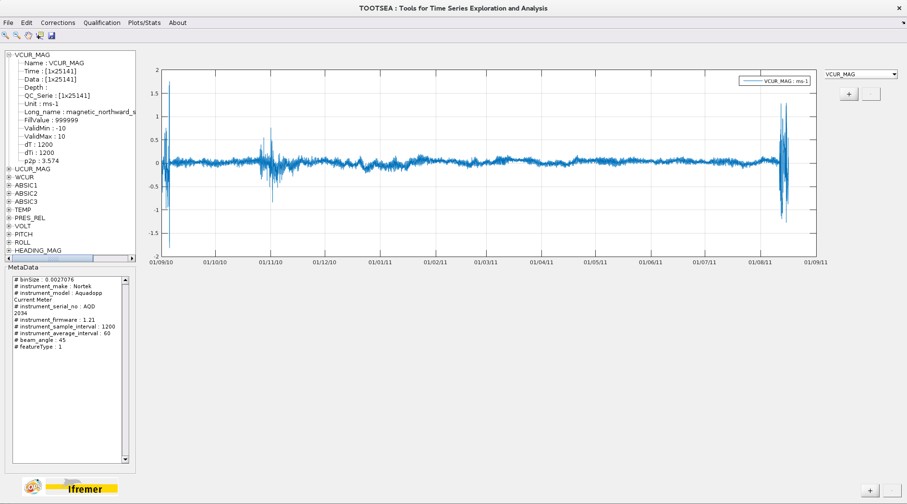  

The main window of the tool is made of 3 areas :
- Data tree : it’s where the data structures are described
- Metadata list
- Visualization : Limited to 5 different axis. No plots limitation per axis. The y axis remains the same for one axis, so the basic usage is to plot parameters of same kind in the same axis.  

# 1. Read
## 1.1 Data from instrument
The idea is to be able to read raw output file from various instruments often used on oceanographic moorings. Some existing parsing/reading functions are implemented [1] and others were developped to fit our needs. The "import" function is accessible from "File" menu. After selecting the parser corresponding to the instrument, and then the data file and sometimes a configuration file (for the RCM11 for example), the function return the different data sets, the name & units and the meta data if present. The first timeserie imported is plotted on the main axis. 

Instrument supported (for now) :
- Aquadopp : .aqd files (Aquadopp_Parser)
- Aquapro : PRF data file (Aquapro_Parser)
- SBE37 : .asc (SBE3x_Parser) and .cnv (SBE37SM_Parser) files
- SBE56 : .cnv (SBE56_Parser) files
- SBE39 : .asc (SBE3x_Parser) files
- RCM11 : .Asc (RCM_Parser) files
- ADCD WH Teledyne: Ensemble binary files (.00x) (WH_Parser)
- ADCD Continental Nortek : Ensemble binary files (.cpr) (Continental_Parser)
- ADCP Signature Nortek : A2CP data file (Signature_Parser)  
- RBR logger (Solo, Duet, Concerto) : .rsk file (RSK_Parser)

## 1.2 From netcdf file
We also want to manage existing netCDF files by reading all or some of the variables. After selecting the nc file, the user has to choose the variables to import in the tool. The first timeserie imported is plotted on the main axis. Only parameters that have the same size than the time vector are loaded. The QC values are automatically imported if VAR_QC exists. The "units", "valid_min", "valid_max", "long_name" and "FillValue" attributes are also imported.  

## 1.3 From saved session
Tootsea also offers the possibility to save and load the working session in a .mat file. This allows to save the current workspace (all the parameters imported or created, the QCs, the new metadata...) to load it later, and finish the processing.  

# 2.Edit 
## 2.1 Edit parameters
When a file is loaded in Tootsea, the name of each parameter is compared with an internal database (here based on OceanSite Parameter description). If the name is recognized, the unit, long_name, FillValue, ValidMin and ValidMax are automatically loaded, but can still be modified (with the "edit" checkbox). If the name isn’t recognized, the user has to fill by hand each field. When a new parameter is created in a process, it inherits from its parent.  

## 2.2 Edit metadata
This function is accessible in the ’Edit’ menu and allows the user to edit metadata imported and add some more. To manually add (or remove) a metadata, the user can click ’+’ (or ’-’) and a new line will be available (or removed) in the table. The user can also import a txt file by clicking on ’Import file’. The file should be an .txt file and structured simply like :  
"Property1","Value"  
"Property2","Value"  
...  
An example file is provided in "Data_test" directory.

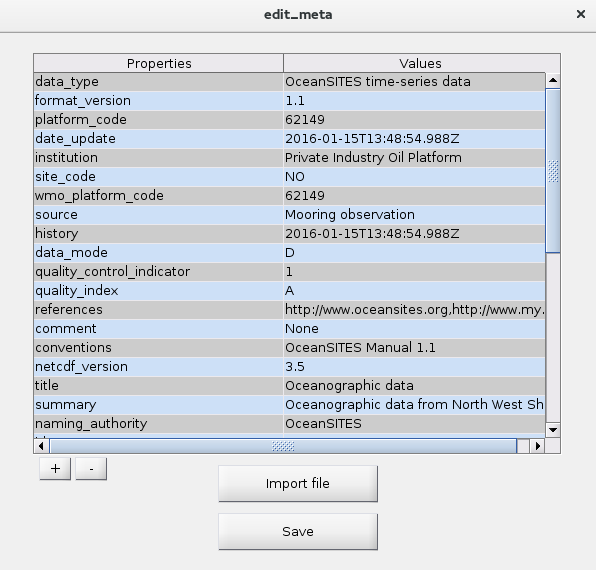  

## 2.3 Create new parameter
This function is accessible from the ’Edit’ menu and allows the user to create a new parameter based on the existing ones. The user can write some code in the console area and then evaluate/save the resulting series. Existing series are accessible with their denomination and the user also has to choose the time dimension (in case the series don’t have the same one). The user can also call matlab function in the code if this function is in the current path.
After clicking on ’Evaluate’, the parameters list turn green if there’s no error and the new parameter appears in the list, otherwise the ’Error log’ panel displays the error. If you ever want to edit the calculated parameter, there’s an access to the formula you used in the "edit parameter" function. You can then modify it to update the calculated parameter.

Example : Create Depth array
~~~
%Access parameter with his name
%Example : TEMP.Data
%Do not edit those variable names
NewParamName = ’DEPTH’ ;
NewParamTime = PRES_REL.Time ;
NewParamValue = −1∗gsw_z_from_p(PRES_REL.Data, 57.58018) ;
NewParamDepth = [] ;
~~~

Example : Remove barotropic tide currents  
This example uses the method described in the CASCADE software developed at LOPS, IFREMER [3].It shows how to remove barotropic tide current from a 1D zonal current array, using TPXO global tides model.
~~~
%Access parameter with his name
%Example : TEMP.Data
[Ut, ConList]= tide_pred(’Common/tides/model/Model_atlas’, UCUR.Time,
58.09521, − 29.38520,’u’ , 1:11 ) ;
%Do not edit those variable names
NewParamName = ’UCUR_filtered’ ;
NewParamTime = UCUR.Time ;
NewParamValue = UCUR.Data − Ut’/100 ;
NewParamDepth = [] ;
~~~  

# 3. Process
## 3.1 Magnetic declination
Once the mandatory "Latitude", "Longitude" and "Nominal_depth" are defined in the metadata section (see Edit metadata), the user can access this function. This function is based on a console where the user can write some matlab code to create new parameters. Each existing variable is accessible with his denomination  representing the structure, the declination is accessible with "dec" variable. Multiple variables can be created at once.

Example :
~~~
var1Name = ’VCUR’ ;
var1Time = VCUR_MAG.Time ;
var1Data = VCUR_MAG.Data ∗ cosd(dec) − UCUR_MAG∗ sind(dec) ;
var2Name = ’VCUR’ ;
var2Time = VCUR_MAG.Time ;
var2Data = VCUR_MAG.Data ∗ sind(dec) + UCUR_MAG∗ cosd(dec) ;
var3Name = ’HEADING ’ ;
var3Time = HEADING_MAG.Time ;
var3Data = HEADING_MAG.Data + dec ;
~~~  

## 3.2 Subserie
The subserie function allows to shorten one or multiple series. The user has to define the series new limits by clicking on ’Set L1/2’ and then double click where to set the limit. The starting date can also be filled/modify by hand in the date field. After choosing the suffix for the new serie(s) name(s), the user can apply the configuration on one or multiple parameters (CTRL+Click to select multiple parameters). The created series should appear in the parameter panel (main panel). The typical use case of this function, is to remove "in air" parts of a moored instrument measurements. In that case, we plot the pressure to detect the deployment and recovery of the instrument and we remove before and after parts. Then we applied the time-settings to all variables. If the parameter has multiple levels, the user has to choose on wich levels apply correction.

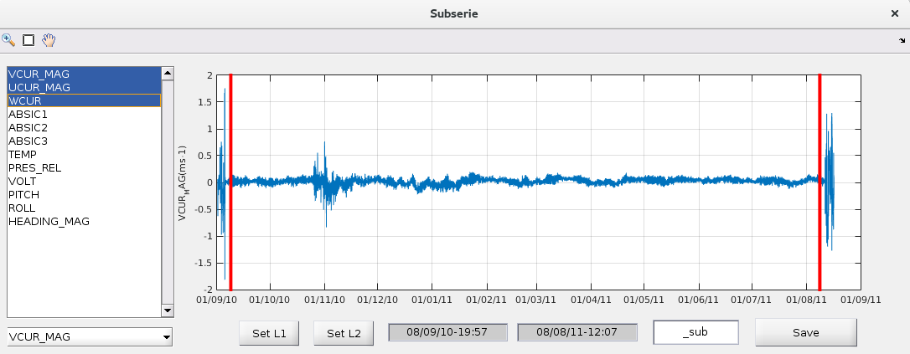  

## 3.3 Interpolate
The "interpolate" function allows the user to interpolate data when there’s a gap in the time serie. The dT used is extracted from the parameter structure. The user has to select the parameter and the level he wants to process and draw a rectangle around the area he wants to interpolate. The new interpolated points should appear in green. Then the user can save the new serie in the main workspace. The "Auto" function interpolates the whole serie. Once a new array is saved with some interpolated points, the QC values associated to those points are automatically set to 8.  

## 3.4 Median filter
The "median filter" function allows the user to create a new parameter by applying a median filter to the chosen parameter and level. After setting the filter window size in number of point, the user can evaluate the filtered result, and then save it the the main workspace. Median filtering can also be used for qualifying the data.

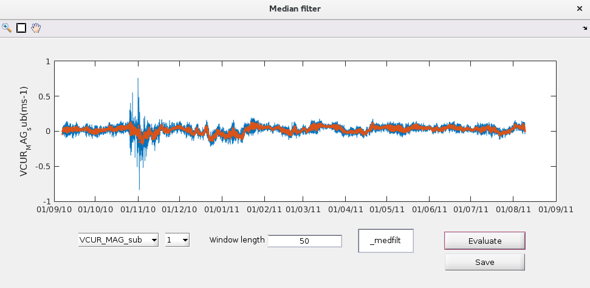  

## 3.5 Drift correction
The "drift correction" function allows to apply a linear correction to a drifting parameter. After selecting the parameter and the level to process, the user can define a constant offset (if necessary) and the coefficient of the linear drift correction. After evaluating the result, the new parameter can be saved. Clock drift can also be corrected. The user define the first and second control dates (instrument and real) and is able to evaluate the linear correction. Then, the user choose on which parameters he wants to apply the correction, and create the new parameters.

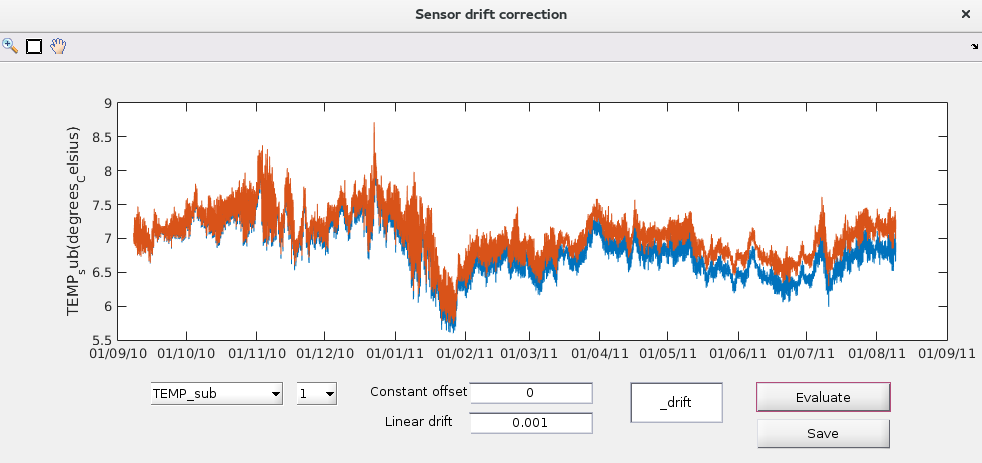  

## 3.6 Decimate
The decimate function allows to set a new dT for the current serie (selected in the menu). The existing dT is displayed if possible, otherwise, the mode(dT) is written as an indication. Two methods of decimation are available :
- One point : take the closest point of the serie for each time stamp.
- Mean value : take the average value calculated on the new time array (mean calculated between (t-dT/2) and (t+dT/2). 
  
After modifying the starting date (default is first point of array) and a setting a mandatory new dT, the user can evaluate the result and then save a new serie.   

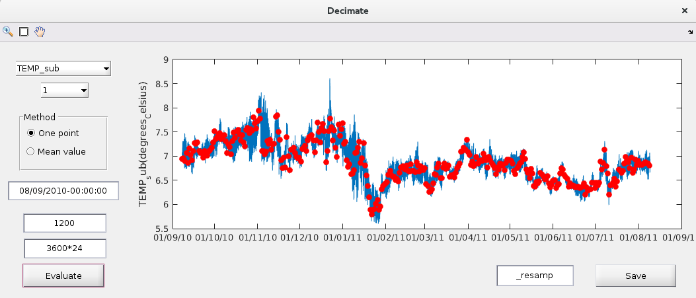  

  
# 4. Plots/Stats
## 4.1 Histogram
The "histogram" plotting function allows display the distribution of one (1D) or two (2D) parameters values.
- 1 dimension : The user selects a parameter and a level in the first menu, and then either select a bin size (for x axis) or the number of bins in the histogram. By default, the histogram is plotted on the min/max interval but the user can set new min/max (both have to be defined, ie : both empty or both filled).
- 2 dimensions : The user selects the two parameters and levels with the two menus (they have to be the same length), and then either select a bin size (for x and y axis) or the number of bins in the histogram (with the slider, the bin size is the same for both axis). By default, the histogram is plotted on the min/max interval of both parameters but the user can set new min/max for both axes (4 have to be defined, ie : 4 empty or 4 filled).

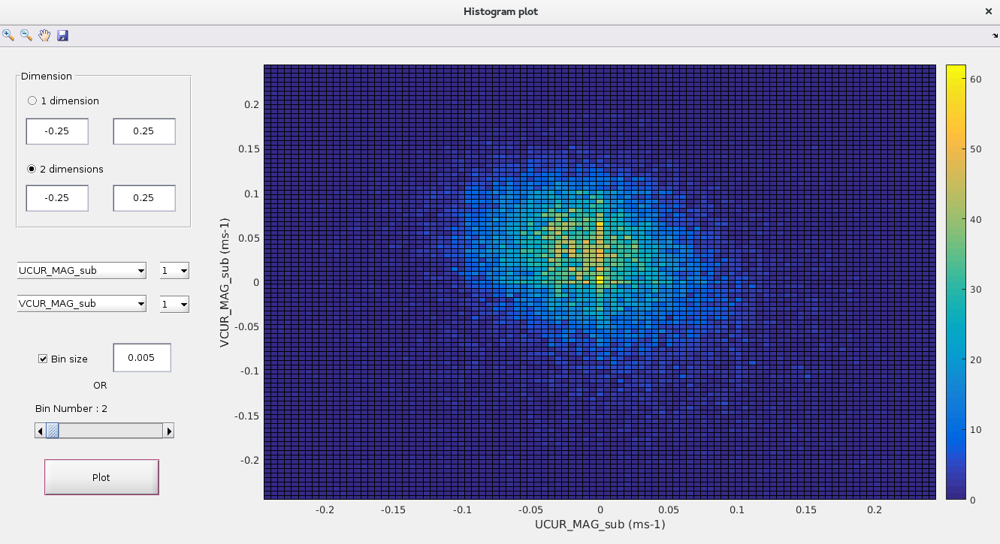  

## 4.2 Dispersion
This a simple scatter plot of one parameter function of another. The user selects 2 parameters and levels that have to be the same length. The color of the points corresponds to the time of the data (see colorbar of the plot).  

## 4.3 Spectrum
This function allows to plot the spectrum of the selected parameter (and level) with some specific options :
- dT : timestep value used to calculate the spectrum (in seconds).
- Flags 1 only : the spectrum is only calculated on good value.
- Interpolation : force the linear interpolation on the serie.
- Window length : length of the calculation window (in points).
- nOverlap : length of the overlapping section between main windows (in points).
- Confidence : Interval of confidence level (in percent) (this parameter is only usefull if you have the signal processing toolbox)

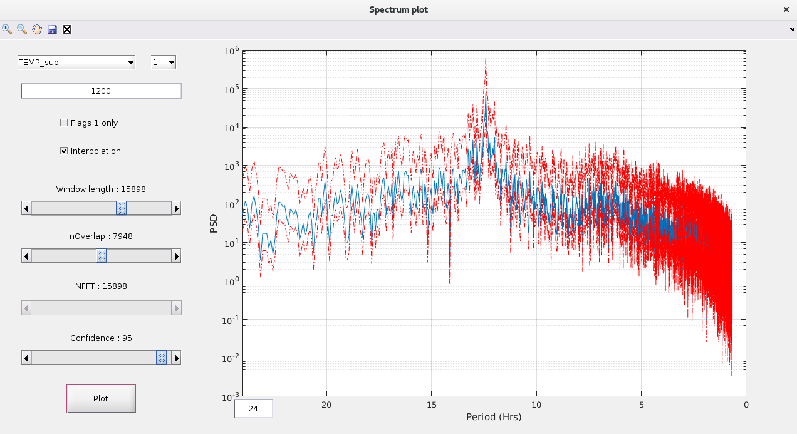  

## 4.4 Stickplot
After selecting the 2 parameters that compose the vectors (for example UCUR and VCUR), the user can modify :
- Length : Maximum length of a sub-axis (in days).
- Step : To avoid overpopulation, the user can set a step > 1 (default) to plot 1 point every step value.

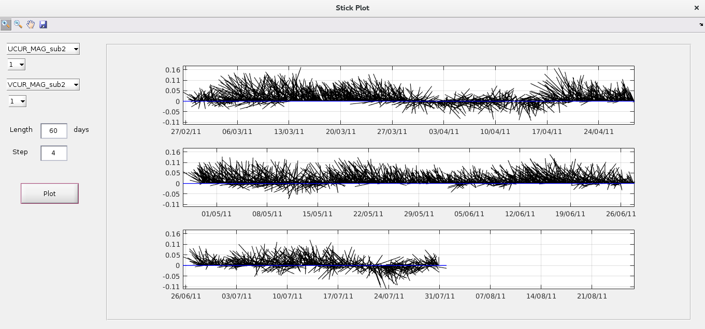  

## 4.5 Global stats
This function produces a list of information and statistics for selected parameters (multiple selection allowed with CTRL+Click). The level selected applies to all parameters with multiple levels.
- Name : Name of the serie
- unit : unit of the serie
- dT : Time step (0 if not regular)
- mean(dT) : mean value of dT array
- mode(dT) : most present value of dT array
- min : minimum value of the serie
- max : maximum value of the serie
- nb_points : number of values in the serie
- min_date : minimum date of the serie
- max_date : maximum date of the serie
- mean : mean value of the serie
- median : median value of the serie
- mode : most common value of the serie
- std : standard deviation of the serie
- var : variance of the serie
- % QC0 : percentage of unqualified data in serie
- % QC1 : percentage of good data in serie
- % QC4 : percentage of bad data in serie
Note : You can export the statistics in a text file with the "Save" button.  

# 5. Qualify
## 5.1 Automatically
The automatic QC function allows to apply to predefined tests to a parameter (for one or more level(s)) and save the QC values in the QC_Serie array in the parameter’s structure :
- Global range : test if min < value < max
- Change rate : test if |Vn - Vn-1| + |Vn - Vn+1| <= 2*threshold
- Stationary : test if N successive values vary
- Median filter : test if (median - c1.std) < value < (median + c2.std) on N points
- Impossible date : test if min_date < time < max_date
- Derived from : When the QC from other parameter(s) is applied. For example, PSAL QC
derives from TEMP, CNDC and PRES QCs. QC is applied only if higher than current one.

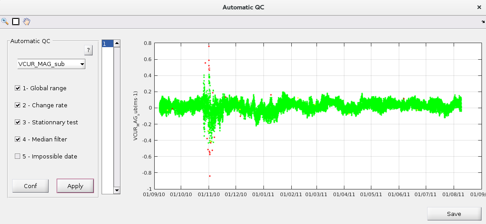  

The configuration of the tests is editable in the Common/autoqc_conf.txt text file or by clicking "Conf" button. In this configuration file, for each parameter we define :
- #TEST TITLE
- name of the matlab test function
- configuration coefficients (detailed in the Qualification Documentation).
- QC value if test passed and QC value if test failed

The serie is displayed according to the QC values with these corresponding colors :  
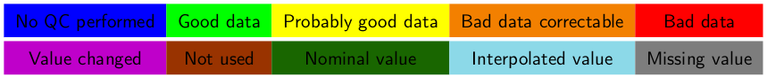  

## 5.2 Manually
Tootsea also allows to qualify the data manually. After selecting the parameter (and
possibly the level), the user has to click on the quality control value he wants to apply and then draw a rectangle around the data he wants to apply the value to. The value should then be colored accordingly. When satisfied, the user can "Apply" to store the changes in the QC_Serie array associated to the parameter.  

## 5.3 Custom
This function allows to apply your own scripts to generate the QC array(s). You can write your own code and call your own function to generate a new QC array that will be assigned to the selected variable in the list menu.  

# 6. Export
## 6.1 NetCDF file
Accessible from "File/Export" menu, this function allows to export one or multiple series to a netcdf file based on the OceanSite conventions. The user has to select the parameter he wants to add in the netcdf file and click "Add". For multilevel parameters, the user is asked either to use the parameters depth value (if available) or to define a new one by hand. He’s then asked to export the
QC array or not. To change the names (or unit, long_name, fillValue, min or max), the user can access the "Edit Parameters" function from there. The metadata listed in the right panel are mandatory. If those are highlighted in green, these metadata
are present. If not, they should be in red, and the user can access the "Edit Metadata" function to create them.

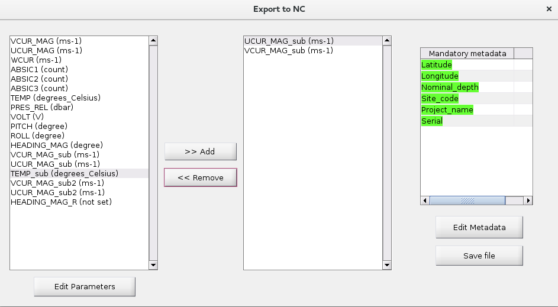  

## 6.2 Ascii file
Accessible from "File/Export" menu, this function allows to export one or multiple series to as ascii file. Two columns are created : Time (in decimal days) and selected variable. If the parameter has multiple level, multiple columns are created (Careful, files can get pretty big for ADCP dataset).  

## 6.3 Save Figures
From most of the "graphic" function windows, the user can save the figure ("Save" icon) in different graphic formats.  

# References
[1] G. Gualibert. Imos toolbox. 2016.  
[2] T. Huck. OVIDE 2. Archimer, 2004.  
[3] C. Kermabon P. Le Bot and F. Gaillard P. Lherminier. Cascade v6.1: Logiciel de validation et de visualisation des mesures adcp de coque. Archimer, 2011.  
[4] V. Thierry, P. Branellec, S. Leizour, and M. Hamon. Compte rendu de la campagne RREX 2015. N/O Thalassa 5 juin 2015 - 10 juillet 2015. Archimer, 2015.  
  

---    
Ressources for logo design : Freepik.com
